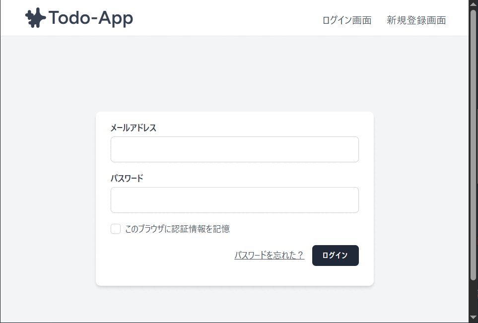

# Todo-App

Laravelを使って作成したシンプルなTodo管理アプリです。
「仕事」「買い物」「プライベート」などカテゴリごとにTodoリストを作成し、その中でTodoを追加・管理できます。

## ✨機能概要
- ユーザー登録・ログイン（Laravel Breezeを使用）
- リスト一覧画面で、各Todoリストをプレビュー表示
- リスト一覧画面から、Todoリストの追加・削除
- Todoの追加・編集・削除
- Todoの完了/未完了の切替

## 🚀動作環境
- Windows
- Laravel Herd 1.22.3
- PHP 8.3
- Laravel 12
- SQLite
- Node.js 25
- npm 11

## 🔧セットアップ手順

1.リポジトリをクローン

bash git clone https://github.com/takuro-ryokawa/todo-app

cd todo-app

2.パッケージインストール
composer install
npm install
npm run build

3.環境変数
cp .env.example .env
php artisan key:generate

4.マイグレーション実行 & 初期データ投入
php artisan migrate --seed

5.起動
URL:http://todo-app.test/

